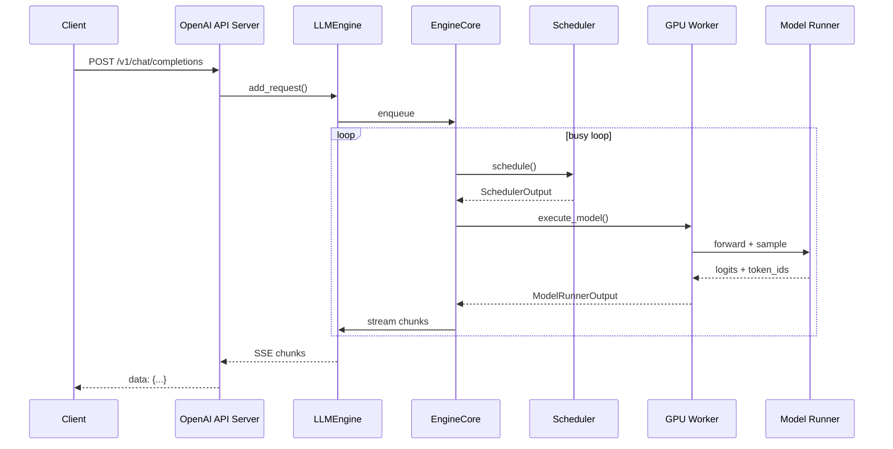

# 博客大纲 #1：vLLM 一个请求的一生

> 目标读者：刚开始读 vLLM 源码的同行
> 字数目标：5000+ 字
> 必带：1 张时序图 + 5+ 段源码片段

## 大纲（按这个顺序写）

### 0. 引子（200 字）

写一段："你是否有过：用 vLLM 跑得很快但一被问'里面怎么实现的'就答不上来？我也是，所以我用 4 周时间把一个请求从 HTTP 进来到 token 出去的全链路跟了一遍。这篇是我的笔记。"

### 1. 全景图（800 字）

放这张 mermaid（W11 完成时画）：



### 2. 第一步：请求到达 API 层（500 字）

- 入口：`vllm/entrypoints/openai/api_server.py`
- 关键 class：`OpenAIServingChat.create_chat_completion()`
- 这一步做了什么：
  - 解析 OpenAI 风格的请求体
  - 转成 vLLM 内部的 `SamplingParams` + `prompt`
  - 调用 `engine.generate()`

**贴源码片段**（5-10 行，加注释）：

```python
# vllm/entrypoints/openai/api_server.py
（粘 5-10 行）
```

### 3. 第二步：进入 EngineCore（800 字）

- 文件：`vllm/v1/engine/core.py`
- 核心循环：busy loop
- 这一步做了什么：
  - 把请求塞入 `waiting` 队列
  - 等下一个 iteration

### 4. 第三步：Scheduler 选谁能进 batch（1500 字 · 重头戏）

- 文件：`vllm/v1/core/sched/scheduler.py`
- 关键函数：`schedule()`
- 这一步做了什么（按伪代码顺序）：
  1. 先 schedule 已在 running 的请求（continuous batching）
  2. 检查 token budget
  3. 如果 budget 还有，从 waiting 队列拉新请求做 prefill
  4. 处理 chunked prefill（同一个 prompt 切成多个 chunk）
  5. 处理 prefix caching（命中的话只 prefill 后缀）
  6. 决定是否需要抢占（preempt）

**贴源码片段**（schedule() 函数主体）

### 5. 第四步：Worker 执行 forward（800 字）

- 文件：`vllm/v1/worker/gpu_model_runner.py`
- 关键函数：`execute_model()`
- 这一步做了什么：
  - 准备输入张量（input_ids、positions、block_table）
  - 用 CUDA Graph 加速（如启用）
  - forward → logits
  - 调 sampler 得到 token_ids

### 6. 第五步：返回 chunk（500 字）

- 文件：`vllm/v1/engine/output_processor.py`
- 流式输出回 API 层

### 7. 我的两个发现（700 字）

- **发现 1**：scheduler 是 Python 写的，但调度不是瓶颈，因为它和 forward pipeline 起来了
- **发现 2**：v1 比 v0 主要改了 ___（你自己填）

### 8. 推荐阅读 + 致谢（200 字）

- 我读这个源码时，最依赖 ___ 这几篇博客 / 视频
- 致谢 vLLM 维护者
- 我提交的 PR 链接

---

## 写作建议

- **不要复述官方文档**：每段都带"我读到这里时的疑问"或"我画了一张图理解这个"
- **截图 / 图大于文字**：能画的都画
- **每个章节末尾留一个"思考题"**：让读者反思（也提高阅读时长，平台算法喜欢）
