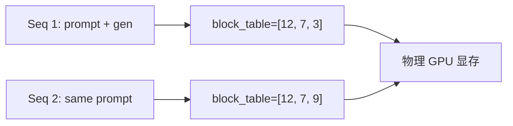

# 博客大纲 #2：PagedAttention 原理与 Block Table 实现

> 目标读者：知道 vLLM 但不懂 PagedAttention 的人
> 字数目标：5000+ 字
> 必带：1 张 OS 类比图 + 1 张 block table 数据结构图 + 源码片段

## 大纲

### 0. 引子（300 字）

写一段："如果你给一个 70B 模型跑 16K 上下文，传统方式要预分配 80GB KV Cache，PagedAttention 能压到 30-40GB。这是怎么做到的？我用一周时间把它的原理和实现挖到底，这是我的笔记。"

### 1. 标准 KV Cache 的浪费（800 字）

- 1.1 为什么需要 KV Cache（用一张图）
- 1.2 传统做法：预分配最大长度 → 内部碎片严重
- 1.3 不同请求长度差异大 → 外部碎片
- 1.4 量化数据：实际显存利用率仅 30-40%（vLLM 论文 Figure 3）

### 2. OS 虚拟内存的类比（800 字 · 关键）

放一张图：

```
[物理内存 / 物理 GPU 显存]
   ↑ block table 映射 ↑
[逻辑序列空间 / 一个 sequence 的 KV]
```

- 2.1 OS 怎么解决进程内存碎片：分页
- 2.2 block table 把"看上去连续"和"物理上分散"解耦
- 2.3 vLLM 把这套思想搬到 KV Cache 上

### 3. Block 是什么（500 字）

- 大小：默认 16 个 token / block
- 维度：(num_layers, 2, num_kv_heads, head_dim, block_size)
- 用 `BlockSpaceManager` 管理 free / allocated

**贴源码片段**：`vllm/v1/core/kv_cache_utils.py` 中 KVCacheBlock 的定义

### 4. Block Table 数据结构（800 字）

- 4.1 每个 sequence 有自己的 block_table（list[BlockId]）
- 4.2 block 内部是连续的，但 block 之间可以跨任意物理位置
- 4.3 prefix caching：多个 sequence 的 block_table 可以指向同一个物理 block（COW）

放一张 mermaid 图：



### 5. PagedAttention CUDA Kernel（1500 字 · 重头戏）

- 5.1 普通 FlashAttention 的访存：连续 K[b, h, :T, d]
- 5.2 PagedAttention 的访存：按 block_table 跳转
- 5.3 实测性能：比 flat attention 慢不到 5%，但显存利用率 ↑ 3-5×
- 5.4 看 `csrc/attention/attention_kernels.cu` 的核心循环

**贴源码片段**：paged_attention_kernel 的核心循环（10-20 行）

### 6. Allocator 怎么 evict（700 字）

- 6.1 LRU 策略
- 6.2 抢占（preempt）：低优先级请求让出 block
- 6.3 swap-out / recompute 的取舍

### 7. 我做的实验（500 字）

- 改 `block_size` 从 16 → 32 看 throughput
- 关掉 prefix caching 看 throughput 下降多少

### 8. 经常被问的面试题 + 答案（500 字）

- Q1：block_size 怎么选？
- Q2：抢占的代价是什么？
- Q3：和 SGLang 的 RadixAttention 有什么差异？

### 9. 推荐阅读（200 字）

- vLLM SOSP'23 论文
- 我读源码用的几篇博客
