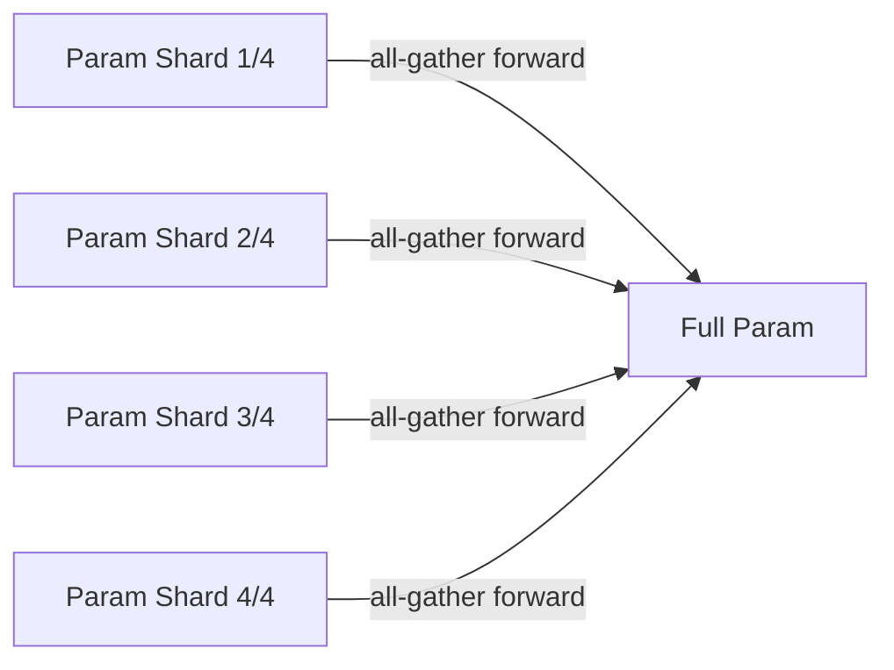

# 01 · 数据并行（DP / DDP / FSDP / DeepSpeed ZeRO）

## DP（最基础）

- 每个 GPU 复制完整模型，处理不同 mini-batch
- backward 后 all-reduce 梯度
- 局限：模型必须装得下单卡

## DDP（PyTorch 标准）

- 在 DP 基础上：用 NCCL all-reduce、ring-reduce、bucket、overlap 优化
- 现在的 baseline

## FSDP（Fully Sharded Data Parallel）

- PyTorch 原生
- 把参数 / 梯度 / optimizer states 都分片到每张卡
- forward 前 all-gather 取齐，forward 后丢弃
- 显存换通信



## DeepSpeed ZeRO

| | 切什么 | 显存节省 | 通信代价 |
|---|---|---|---|
| ZeRO-1 | optimizer states | 4× | 同 DDP |
| ZeRO-2 | + gradients | 8× | 同 DDP |
| ZeRO-3 | + parameters | 与 GPU 数成正比 | 增加 1.5× |

ZeRO-3 ≈ FSDP（思路一样，DeepSpeed 先实现的）

## ZeRO-Offload / ZeRO-Infinity

- Offload 到 CPU 内存
- Offload 到 NVMe
- 适合显存爆炸的场景，但 throughput 大幅下降

## 实验记录（W17 跑完后填）

```
模型: GPT-2 350M
硬件: 4× A10 24GB

DDP        : __ samples/s, peak mem __ GB
FSDP       : __ samples/s, peak mem __ GB
ZeRO-2     : __ samples/s, peak mem __ GB
ZeRO-3     : __ samples/s, peak mem __ GB
```

## 我的发现 / 面试可讲

```
（模型多大时 DDP 还能用？什么时候必须 FSDP？ZeRO 和 FSDP 的取舍？）
```
