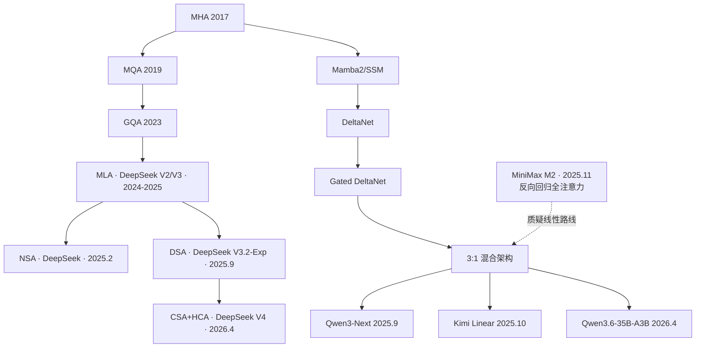

# 博客模板：2026 大模型架构两大流派 · 压缩稀疏 vs 门控线性

> 字数目标：5000-8000 字
> 必带：mermaid 演进图 × 1、对比表 × 5、核心公式 × 3、复现代码段 × 2

## 0. 引子（300 字）

```
（写一段：2026 年 4 月，DeepSeek V4 和 Qwen3.6 一周之内相继开源，
两个模型都把"百万上下文"变成日常可用，但走的路线截然相反。
这篇是我用两周时间精读两份技术报告 + 复现核心创新的笔记。）
```

## 1. 一张图看懂演进（800 字）

放本目录下的 `evolution.mmd` 渲染图。



## 2. 流派 A · 压缩稀疏（DeepSeek V4 路线）

### 2.1 思想：把全局 attention 用各种方法降到次平方

### 2.2 V3 → V3.2 → V4 三代对比表

| 维度 | V3 (MLA) | V3.2 (DSA) | V4 (CSA+HCA) |
|---|---|---|---|
| KV 表示 | latent vector c | latent + Lightning Indexer | 压缩 KV 块 + indexer |
| 稀疏粒度 | 无 | top-k=2048 token | top-k 在压缩块上 |
| 复杂度 | O(L²) | O(L*k) | O((L/m)*k) |
| 1M KV cache | 1/25 of MHA | 同 | 1/50 of MHA |

### 2.3 V4 三大创新逐个讲

#### 2.3.1 mHC（Manifold-Constrained Hyper-Connections）

放公式：

```
x_mixed = B @ x_pre, B ∈ Birkhoff polytope
```

#### 2.3.2 CSA + HCA 混合注意力

放本目录 `dsa_lightning_indexer.py` 中的核心 100 行复现代码。

#### 2.3.3 Muon 优化器（替代 AdamW）

```
Muon: θ ← θ - lr * orthogonalize(m)
```

## 3. 流派 B · 门控线性（Qwen3.6 路线）

### 3.1 思想：用 RNN-style 状态替代 KV Cache

### 3.2 Qwen3 → Qwen3-Next → Qwen3.6 三代

```
Qwen3:    GQA + MoE + Hybrid Thinking
Qwen3-Next: 引入 Gated DeltaNet 混合
Qwen3.6:    + 多模态 + 思维保留
```

### 3.3 Gated DeltaNet 状态更新公式

```
S_t = β_t ⊙ S_{t-1} + Δ_t ⊗ (K_t ⊗ V_t)
```

放本目录 `gated_deltanet.py` 中的 50 行复现代码。

### 3.4 3:1 混合策略

每 3 层线性 + 1 层全注意力。为什么是 3:1 不是 5:1？

## 4. 流派 C · 反向案例 · MiniMax M2

```
（一段话讲为什么 MiniMax 选回归全注意力）
```

## 5. 三条路线对比表

| 维度 | 压缩稀疏（V4） | 门控线性（Qwen3.6） | 全注意力（M2） |
|---|---|---|---|
| KV 大小 | O(N/m * k) | O(1) state | O(N) |
| 计算复杂度 | O((L/m) * k) | O(L) | O(L²) |
| 长上下文成本 | 低 | 极低 | 高 |
| Agent 场景精度 | ? | 中 | 高 |
| Benchmark 一致性 | 高 | 中 | 高 |
| 推理 kernel 复杂度 | 高 | 中 | 低 |

## 6. 我的预测（500 字）

```
（你怎么看哪条路线会赢？为什么？）
```

## 7. 推理工程师能从中学到什么

每条路线对推理 infra 提出的不同需求：

- **V4 路线**：需要 fp8 indexer kernel、稀疏 attention kernel（vLLM 不支持，要自己写）
- **Qwen3.6 路线**：需要 chunked DeltaNet kernel、状态管理（vLLM 0.19 支持）
- **M2 路线**：靠 RadixAttention 吃 prefix sharing 红利（SGLang 优势场景）

## 8. 推荐阅读 + 致谢
